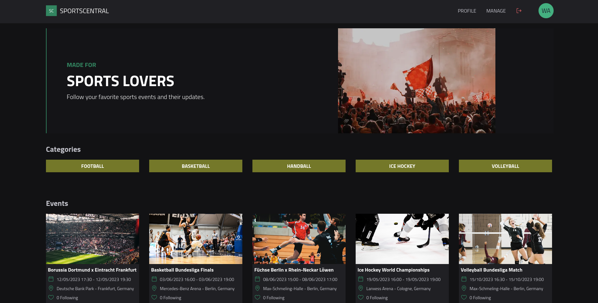
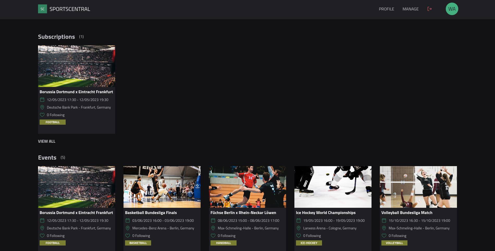

<p align="center">
  
</p>

<br />


## About

<p>SportsCentral is is a sporting events platform that allows fans to register for sporting events, view details and information, and keep up with all event updates.</p>

https://sportscentral.vercel.app/

## Features

- ⚡️ Next.js 13
- ⚛️ React 18
- ⛑ TypeScript
- ☯️ Chakra-UI - A simple, modular and accessible component library
- 🧪 Cypress — For application e2e tests
- 📏 ESLint — To find and fix problems in your code
- 💖 Prettier — Code Formatter for consistent style
- 🐶 Husky — For running scripts before committing
- 🚓 Commitlint — To make sure your commit messages follow the convention
- 🖌 Renovate — To keep your dependencies up to date
- 🚫 lint-staged — Run ESLint and Prettier against staged Git files
- 👷 PR Workflow — Run Type Check & Linters on Pull Requests
- ⚙️ EditorConfig - Consistent coding styles across editors and IDEs
- 🗂 Path Mapping — Import components or images using the `@` prefix

## Screenshots





## Available Application Routes

### PUBLIC ROUTES (no requires sign-in to view)

The public routes are optimized for SEO (Search engine optimization, using NextJS features)

- `/` — Homepage.
- `/sign-in` — Sign-in page.
- `/sign-up` — Sign-up page.
- `/events` — All available events.
- `/events/category/:id` — All available events by category.
- `/event/:id` — Event page.

### PRIVATE ROUTES (regular user and admin):

- `/dashboard` — Dashboard page with user subscriptions and available events and event categories.
- `/dashboard/profile` — User profile.
- `/dashboard/subscriptions` — User event subscriptions.

### ADMIN ROUTES (only admin users have permission to access):

USERS MANAGEMENT

- `/dashboard/admin/users` — List and manage all platform users (list, delete, update controls).
- `/dashboard/admin/users/create` — Register a new user.
- `/dashboard/admin/users/edit/:id` — Edit users.

EVENTS MANAGEMENT

- `/dashboard/admin/events` — List and manage all events (list, delete, update controls).
- `/dashboard/admin/events/create` — Register a new event.
- `/dashboard/admin/events/edit/:id` — Edit events.

CATEGORIES MANAGEMENT

- `/dashboard/admin/categories` — List and manage all categories (list, delete, update controls).
- `/dashboard/admin/categories/create` — Register a new category.
- `/dashboard/admin/categories/edit/:id` — Edit categories.

## Sign-in Credentials

**Admin user**
```
email: admin@sportscentral.com
password: sportscentral
```

**Regular user**  
```
email: user@sportscentral.com
password: sportscentral
```

## Documentation
### Application Directory Structure

- [`.github`](.github) — GitHub configuration including the CI workflow.<br>
- [`.husky`](.husky) — Husky configuration and hooks.<br>
- [`public`](./public) — Static assets such as robots.txt, images, and favicon.<br>
- [`src`](./src) — Application source code, including pages, components, styles.
- [`src`](./src/components) — Application shared components.
- [`src/layout`](./src/layout) — Layout composition components.
- [`src/contexts`](./src/contexts) — Application Contexts.
- [`src/data`](./src/data) — json-server database.
- [`src/domain`](./src/domain) — Application domain layer (models, entities, usecases).
- [`src/helpers`](./src/helpers) — Application helper functions and formatters.
- [`src/infra`](./src/infra) — HTTP client and platform configuration.
- [`src/pages`](./src/infra) — Application Pages.
- [`src/theme`](./src/theme) — Application theme, tokens and design-system configuration.

### Requirements

- Node.js >= 12.22.0
- Yarn

### How to run the application locally:

The application uses a local server composed by a JSON file, located in `src/data/server.json`

Start the json-server using `yarn dev:server` and the application with `yarn:dev` in the terminal

### Switch to Yarn/npm

If you'd like to switch to npm/pnpm, to run locally, delete the `yarn.lock` file, install the dependencies with npm/pnpm.
This application uses yarn by default in the application CI and workflow.

### Scripts

- `yarn dev` — Starts the application in development mode at `http://localhost:3000`.
- `yarn build` — Creates an optimized production build of your application.
- `yarn start` — Starts the application in production mode.
- `yarn type-check` — Validate code using TypeScript compiler.
- `yarn lint` — Runs ESLint for all files in the `src` directory.
- `yarn format` — Runs Prettier for all files in the `src` directory.
- `yarn cypress` — Runs Cypress locally.
- `yarn test:e2e` — Runs the Cypress e2e tests locally.

### Path Mapping

TypeScript are pre-configured with custom path mappings. To import components or files, use the `@` prefix.

```tsx
import { Button } from '@/components/Button';

// To import images or other files from the public folder
import avatar from '@/public/avatar.png';
```
## Final considerations

The conception of the application was based on the creation of the product 'SportsCentral' and meeting the requirements of the provided document.

Some important points can be taken into consideration according to the evolution of the application, such as security in user authentication, accessibility factors, responsiveness and performance with use, and an API with real data.

The following are the areas of improvement that can be focused on the SportsCentral application:

- Writing Detailed Tests (e2e and unitary, consuming a real-data API)

- Improving Performance with Caching Libraries (React Query / RTK)

- Increasing Security in API Requests and Login (JWT / Basic Auth)


Thank you for the opportunity to create such a cool project and I look forward to technical feedback on the application.
